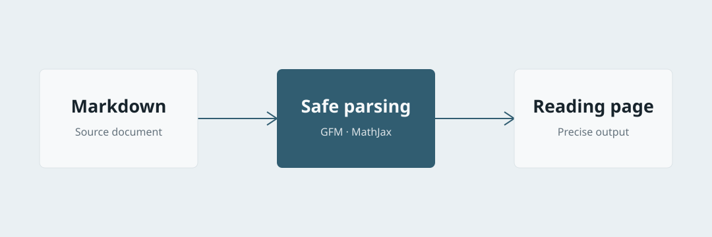
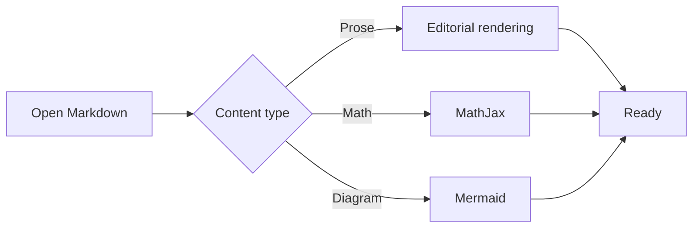

# Precise Reading, Quietly Presented

This document exercises the complete **MDReader** rendering surface. It combines long-form prose, links, structured content, code, images, and mathematical notation to verify the visual rhythm of a technical document.

> A good reader never competes with the content. It keeps complex structures clear and contains failures locally.

## Document Structure

Body text should maintain a comfortable reading measure. This paragraph includes an [external link](https://www.example.com), which should open in the default browser instead of navigating inside the reader window.

- First-level unordered item
  - Nested item
  - Another nested item
- Return to the first level

1. Parse Markdown
2. Sanitize unsafe HTML
3. Typeset mathematical notation

- [x] CommonMark and GFM
- [x] Mathematical notation
- [x] System light and dark appearances

| Capability | Status | Notes |
| --- | ---: | --- |
| GFM tables | Supported | Wide tables scroll locally |
| LaTeX | Supported | MathJax is bundled for offline use |
| Mermaid | Not yet supported | Planned for a future version |

## Syntax Highlighting

```swift
struct Article: Sendable {
    let title: String
    let markdown: String
}

func readingTime(words: Int) -> Int {
    max(1, words / 260)
}
```

```javascript
export async function render(source) {
  const html = await processor.process(source)
  return String(html)
}
```

Inline code such as `MathJax.typesetPromise()` should remain legible without becoming visually dominant.

## Mathematical Notation

The inline formula $E = mc^2$ should align naturally with the text baseline. Bayes' theorem appears as a display equation:

$$
P(A \mid B) = \frac{P(B \mid A)P(A)}{P(B)}
$$

A rotation matrix uses a fenced `math` block:

```math
\mathbf{R}(\theta) =
\begin{bmatrix}
\cos\theta & -\sin\theta \\
\sin\theta & \cos\theta
\end{bmatrix}
```

The following expression uses native MathML:

<math display="block" xmlns="http://www.w3.org/1998/Math/MathML">
  <mrow>
    <mi>f</mi><mo>⁡</mo><mfenced><mi>x</mi></mfenced>
    <mo>=</mo><msup><mi>x</mi><mn>2</mn></msup>
  </mrow>
</math>

## Images

A local relative image:



A remote image, which should degrade locally when the network is unavailable:


## Diagrams

Mermaid diagrams render locally as responsive inline SVG. The reader also recognizes unlabelled fenced blocks whose first meaningful line is a Mermaid diagram directive.



## Footnotes and Closing

Footnotes should appear at the end of the document and preserve accessible return links.[^renderer]

[^renderer]: MDReader bundles its rendering resources, so text, code, and math remain available offline.

---

At this point, heading hierarchy, long-form rhythm, code, tables, images, and mathematical notation should share one consistent visual language.
